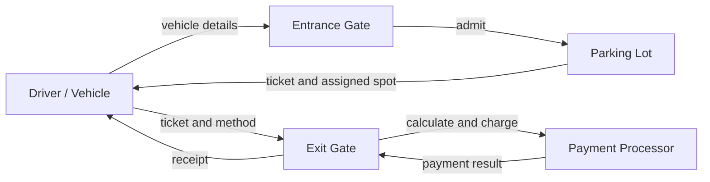
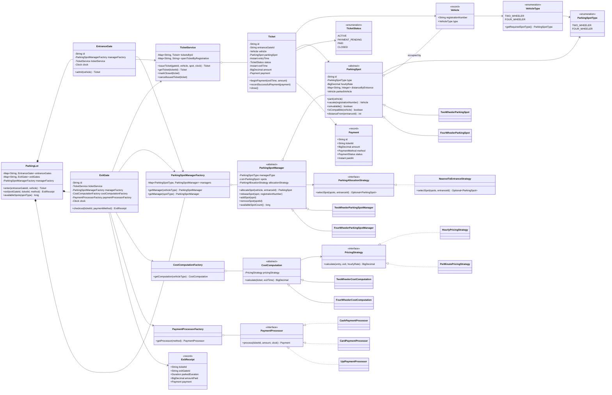
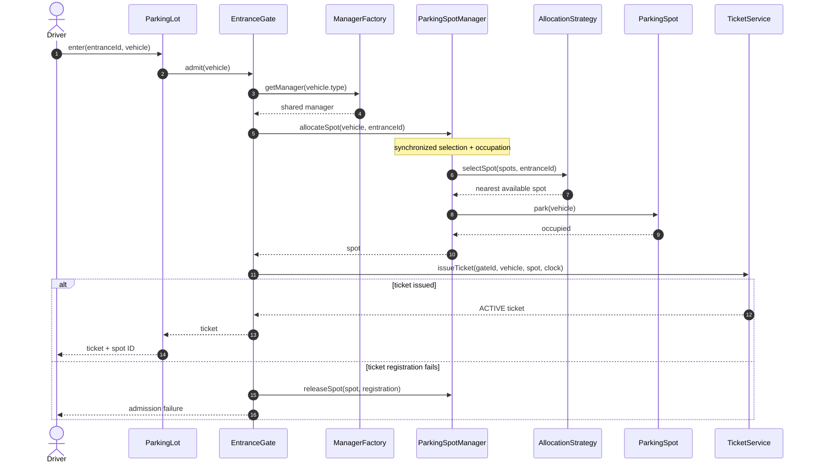
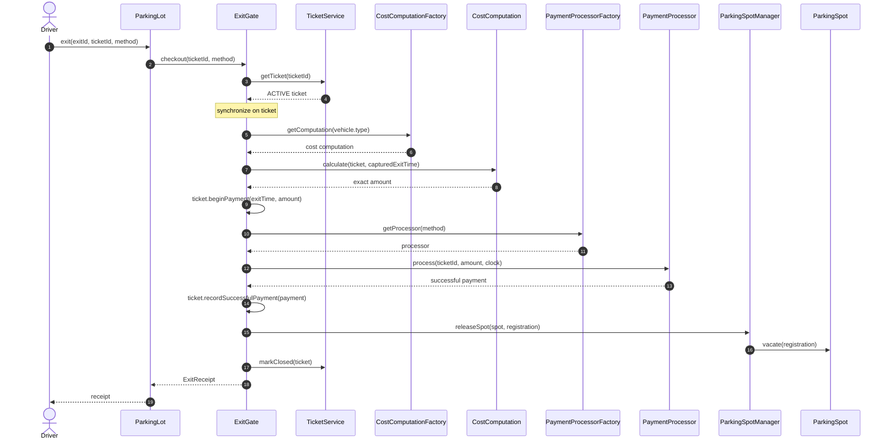
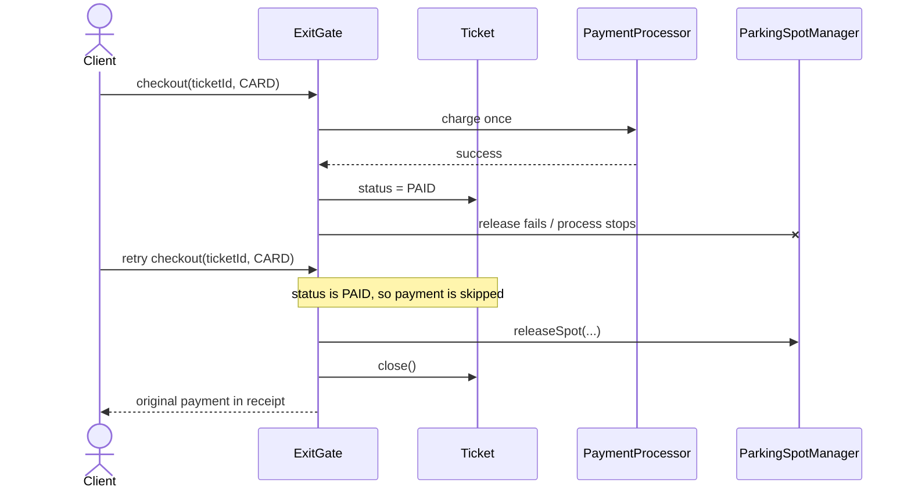
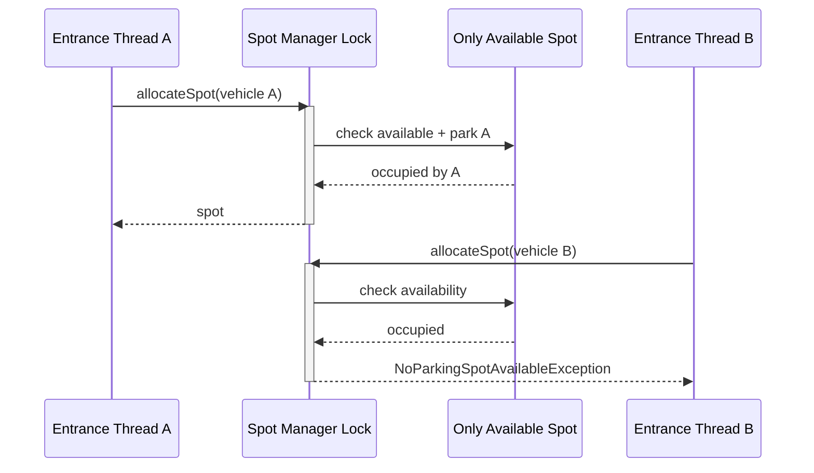
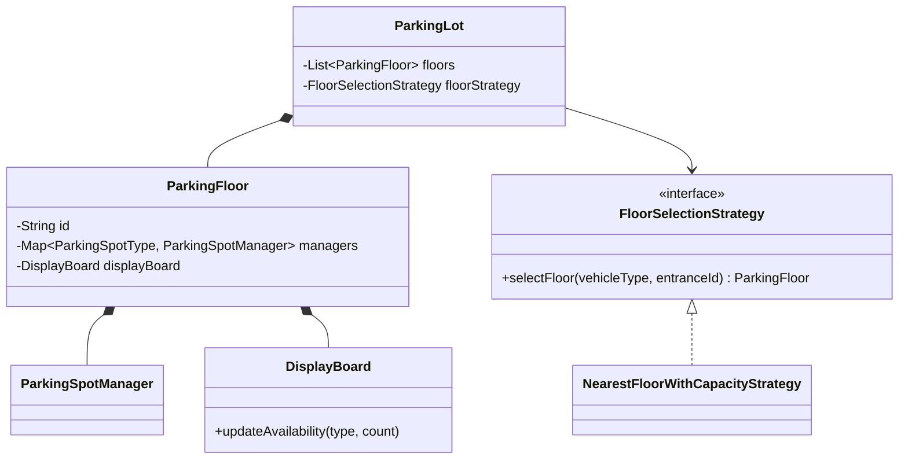
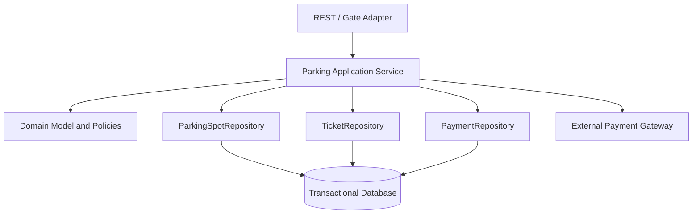

# Parking Lot LLD Diagrams

These diagrams match the runnable implementation. The final section labels future extensions separately so they are not confused with implemented behavior.

## 1. System Context



## 2. Core Class Diagram



## 3. Entry Sequence



## 4. No-Capacity Entry

```mermaid
sequenceDiagram
    actor Driver
    participant Gate as EntranceGate
    participant Manager as ParkingSpotManager
    participant Strategy as AllocationStrategy

    Driver->>Gate: admit(vehicle)
    Gate->>Manager: allocateSpot(vehicle, entranceId)
    Manager->>Strategy: selectSpot(spots, entranceId)
    Strategy-->>Manager: Optional.empty
    Manager-->>Gate: NoParkingSpotAvailableException
    Gate-->>Driver: entry rejected; no ticket created
```

## 5. Successful Exit Sequence



## 6. Payment Failure and Retry

```mermaid
sequenceDiagram
    autonumber
    actor Driver
    participant Gate as ExitGate
    participant Ticket
    participant Processor as PaymentProcessor
    participant Manager as ParkingSpotManager

    Driver->>Gate: checkout(ticketId, CARD)
    Gate->>Ticket: beginPayment(exitTime, amount)
    Ticket-->>Gate: PAYMENT_PENDING
    Gate->>Processor: process(ticketId, amount)
    Processor-->>Gate: failure / timeout
    Gate-->>Driver: PaymentFailedException
    Note over Ticket,Manager: amount and exit time retained; spot remains occupied

    Driver->>Gate: checkout(ticketId, UPI)
    Note over Gate: sees PAYMENT_PENDING; does not recalculate
    Gate->>Processor: process(ticketId, same amount)
    Processor-->>Gate: successful payment
    Gate->>Ticket: recordSuccessfulPayment(payment)
    Gate->>Manager: releaseSpot(spot, registration)
    Gate->>Ticket: close()
    Gate-->>Driver: receipt
```

## 7. Retry After Payment but Before Release



## 8. Ticket State Diagram

```mermaid
stateDiagram-v2
    [*] --> ACTIVE: ticket issued after spot occupation
    ACTIVE --> PAYMENT_PENDING: capture exit time and amount
    PAYMENT_PENDING --> PAYMENT_PENDING: payment failed; retry allowed
    PAYMENT_PENDING --> PAID: successful matching payment recorded
    PAID --> PAID: release failed; retry cleanup
    PAID --> CLOSED: assigned spot released
    CLOSED --> CLOSED: duplicate checkout returns existing receipt
    CLOSED --> [*]
```



Illegal transitions to mention:

- `ACTIVE -> CLOSED`: unpaid exit.
- `PAYMENT_PENDING -> CLOSED`: payment not confirmed.
- `PAID -> PAYMENT_PENDING`: duplicate charge risk.
- Replacing the amount or exit time during a retry.

## 9. Atomic Allocation Race



The lock covers selection and occupation. Locking only the spot does not make a separate `find` operation atomic.

## 10. Future Multi-Floor Extension

This is not part of the current implementation.



## 11. Production Persistence Boundary



In production, application services own transaction boundaries. Domain entities should not execute SQL or call HTTP payment APIs directly.