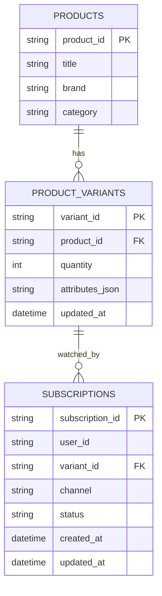
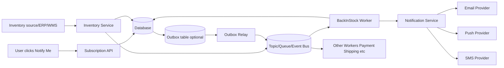
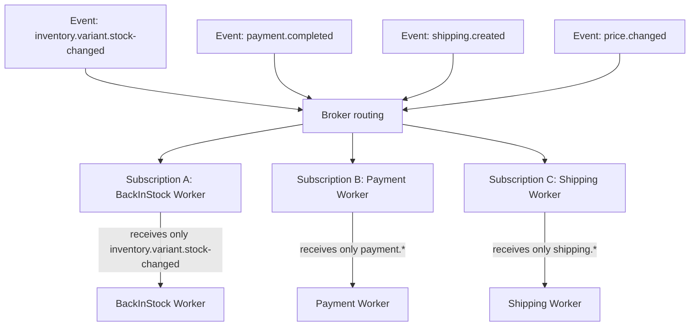
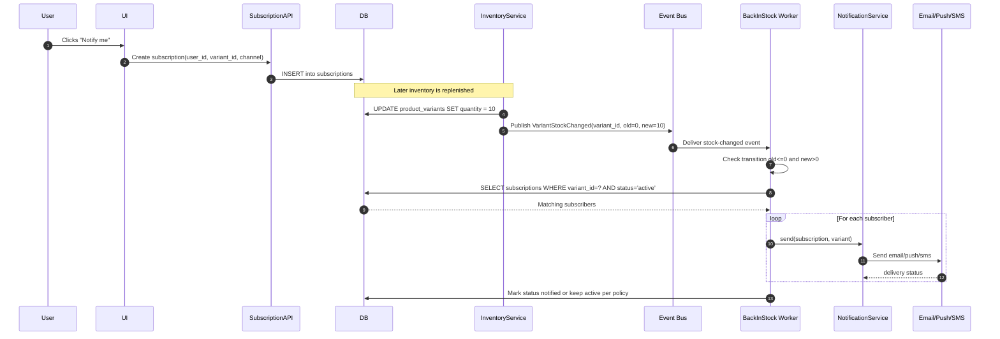
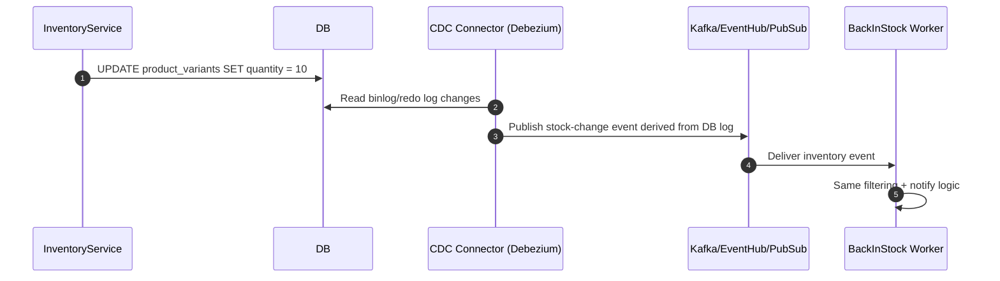

# Back-in-Stock Notification - Full Flow Diagram

This file explains complete end-to-end flow for variant-level back-in-stock notifications.

## 1) Data Model Diagram

Notes:
- `PRODUCTS` is one table for all products.
- `PRODUCT_VARIANTS` is one table for all variants; `attributes_json` captures category-specific properties.
- `SUBSCRIPTIONS` stores user-to-variant interest.

---

## 2) App-Published Event Architecture (most common)

Notes:
- You either publish directly from service or via outbox relay.
- Multiple workers consume from same platform but different topics/subscriptions.

---

## 3) Worker Event Filtering Diagram

This is why back-in-stock worker does not process thousands of unrelated events.

---

## 4) Runtime Sequence (App-Published Event)

---

## 5) CDC/Binlog Alternative Sequence

Use CDC when you want standardized event capture from DB changes without modifying all writer services.

---

## 6) Reliability and Control Points

- **Idempotency:** Worker should avoid duplicate notifications for same user+variant+version.
- **Retries + DLQ:** Broker retries transient failures; poison messages go to dead-letter queue.
- **Backpressure:** Queue decouples spike in stock updates from notification throughput.
- **Observability:** Track publish lag, consumer lag, success/failure rate, and DLQ count.
- **Policy:** Decide whether to keep subscription active after first notify.

---

## 7) Terminology notes (quick one-liners)

- **Outbox table:** DB table storing pending events that must be published reliably.
- **Outbox relay:** Background process that reads outbox rows and publishes them to broker.
- **Broker:** Messaging system that accepts events and routes them to consumers.
- **Topic/stream:** Named channel where related events are published.
- **Subscription (broker-side):** Consumer binding that receives events from selected topic/routing rules.
- **Routing:** Rule-based delivery of events to matching queues/subscriptions.
- **Consumer:** Worker process that reads and handles events.
- **DLQ (Dead-Letter Queue):** Queue for failed messages after retry limit.
- **Retry:** Attempt to process same failed event again after delay/backoff.
- **Idempotency:** Safe repeated handling of same event without duplicate user notifications.
- **CDC:** Change Data Capture; turns database row changes into external events.
- **Binlog/redo log:** Database internal transaction log used by CDC connectors.
- **Debezium:** CDC connector that reads DB logs and emits structured events.
- **ERP/WMS:** Upstream inventory systems (Enterprise Resource Planning / Warehouse Management System).
- **Backpressure:** Throughput control to prevent worker/provider overload during event spikes.
