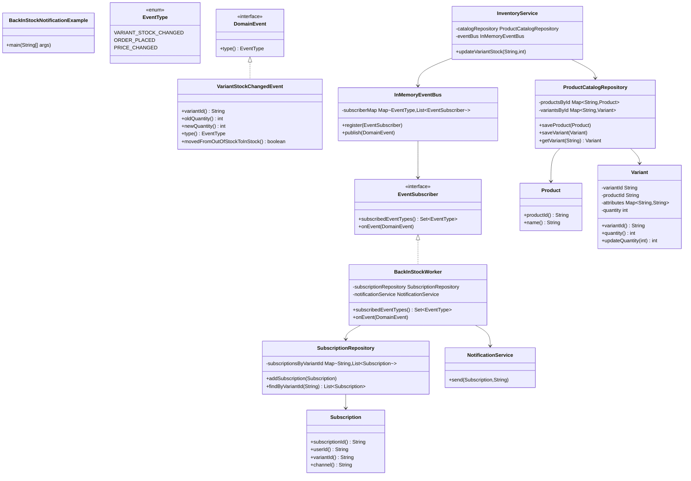
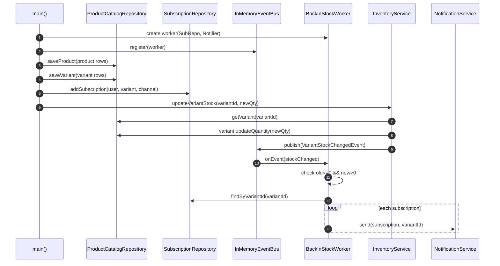

# Code Diagram - BackInStockNotificationExample.java

This README is focused only on the Java code structure and call flow from:

- `src/designpatterns/observablepattern/example/BackInStockNotificationExample.java`

## 1) Class/Type Relationship Diagram

## 2) Runtime Flow in This Code

## 3) Minimal responsibility map

- `InventoryService`: updates stock and emits stock-change event.
- `InMemoryEventBus`: routes events only to subscribers of that event type.
- `BackInStockWorker`: listens only for stock-change events and applies back-in-stock condition.
- `SubscriptionRepository`: resolves who subscribed to that exact variant.
- `NotificationService`: sends final user notification on selected channel.
